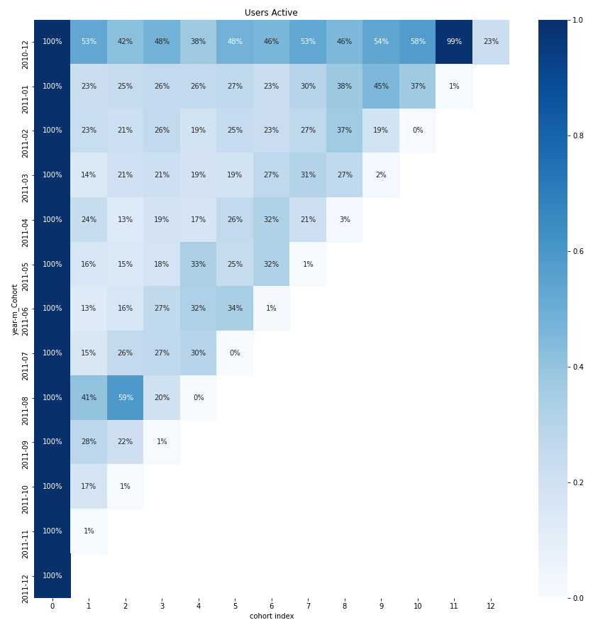
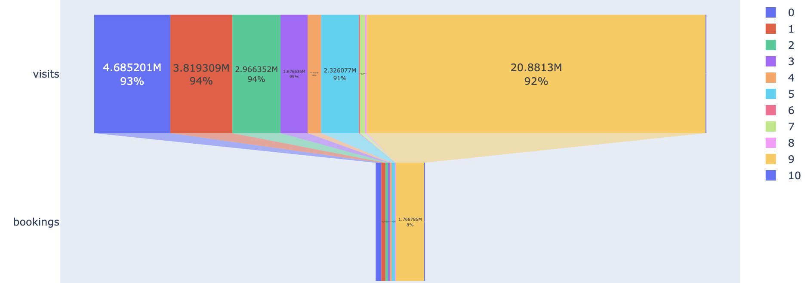

# User analysis

This repository is divided into three parts:

## 1. User analysis
[See Jupyter Notebook](cohort%20retention%20and%20CLV.ipynb)
  1. Segmented cohort analysis
  2. Segmented retention analysis
      
  3. Customer life time value analysis and prediction
  4. User funnel analysis  [Open with nbviewer](https://nbviewer.jupyter.org/github/reejungkim/User-Analysis/blob/master/Expedia%20Funnel%20analysis.ipynb)
      

  5. Traffic analysis
      
  
## 2. Geographic vizualization of sales using Folium
  [Open with nbviewer](https://nbviewer.jupyter.org/github/reejungkim/User-Analysis/blob/master/Geographic%20mapping%20-%20Folium.ipynb)

## 3. Rcommendation system based on market basket analysis
[See Jupyter Notebook](Market%20Basket%20Analysis.ipynb)
<!--  -->

## 4. Recommendation system using collaborative filtering
[See Jupyter Notebook](Movie%20recommendation%20system.ipynb)

